> 免责声明：
>
> 1. 在根据本教程进行实际操作时，如因您操作失误导致出现的一切意外，包括但不限于路由器变砖、故障、数据丢失等情况，概不负责；
> 2. 该技术仅供学习交流，请勿将此技术应用于任何商业行为，所产生的法律责任由您自行承担；
> 3. 部分学校明令禁止使用路由器上网，相关文件请点击[广东工业大学校园网责任书](http://nic.gdut.edu.cn/fj/xuesheng1003.doc)、[厦门大学校园网责任书](https://net.xmu.edu.cn/_upload/article/files/e0/35/162b0f8849c4816e669df3a4f11c/dd7b487e-a51d-4e41-8d8e-d9fd42338a33.pdf)查看。本教程仅用于交流使用，安装路由器的行为完全是您个人意志所决定的，如您已成功安装，请在 24 小时内重置路由器至原出产状态；
> 4. 请按照学校推荐的方式连接到互联网，如因个人问题受到相关校规追责，由您自行承担。


# 前言

本教程教您如何在[Drcom](https://wiki.archlinux.org/index.php/Drcom_(%E7%AE%80%E4%BD%93%E4%B8%AD%E6%96%87))下使用路由器上校园网(以广东工业大学、极路由1S HC5661A为例)

本教程适合使用[Drcom](https://wiki.archlinux.org/index.php/Drcom_(%E7%AE%80%E4%BD%93%E4%B8%AD%E6%96%87))进行拨号上网的用户，同时，要求您的路由器支持刷入第三方系统，如openwrt。由于是针对新手的教程，所以叙述部分可能会比较冗杂，您可自行跳到不同的章节。

本教程以极路由1S HC5661A为例，不同型号路由器所对应的教程略有不同，请您注意。


本教程非原创，在以下开发者的基础上进行改进：

[GJXS](https://www.gjxslisa.club/2018/10/27/drcom/?)、[NickHopps](https://blog.csdn.net/liucheng2012560/article/details/78755309)、[陈浩南](https://chn.moe/sub/study/index.php/archives/20/)

<br /><br />

# 准备工作

- 一款支持刷入第三方系统([openwrt](https://openwrt.org/))的路由器
- **该路由器已联网并获得开发者(root)权限**
- **一根网线**
- 下载软件[WinSCP](./software/WinSCP-5.13.7-Setup.exe)
- 下载软件putty，32位操作系统请下载[putty32](./software/putty32.exe)，64位系统请下载[putty64](./software/putty64.exe)

<br /><br />

# 步骤一:获取路由器root权限

以`极路由1S HC5661A`为例，在您购买满14天后，请先登录极路由器后台，然后依次开通、安装开发者插件

- [x] 开通开发者模式：“云插件”>“路由器信息”>“高级设置”>“开通” 
- [x] 安装开发者插件：“云插件”>“全部插件”>“开发者模式”>”确定” 

其他路由器可查看其他教程获取root权限。

<br /><br />

# 步骤二:刷入不死Breed

## 下载Breed

[Breed](https://breed.hackpascal.net/)是一个路由器的Bootloader（Bootloader 意为引导加载器，即为用于加载操作系统的程序。它是一大类此类功能程序的统称。现在的 BIOS、UEFI、GRUB、RedBoot、U-Boot、CFE等都是 Bootloader），装它的目的是为了下一步刷入固件（ROM）。以`极路由1S HC5661A`为例，**不同型号下载不同的Breed，请务必对号入座**，下载[breed-mt7628-hiwifi-hc5661a.bin](./breed/breed-mt7628-hiwifi-hc5661a.bin)

<br /><br />

## 上传到指定目录

使用WinSCP登入你的路由器后台，其中：

主机名：你的后台管理地址(比如192.168.1或者192.168.1.199)

账号：root 

密码 ：你的后台管理密码

端口：1022或者22(自行测试) 

模式：SCP 

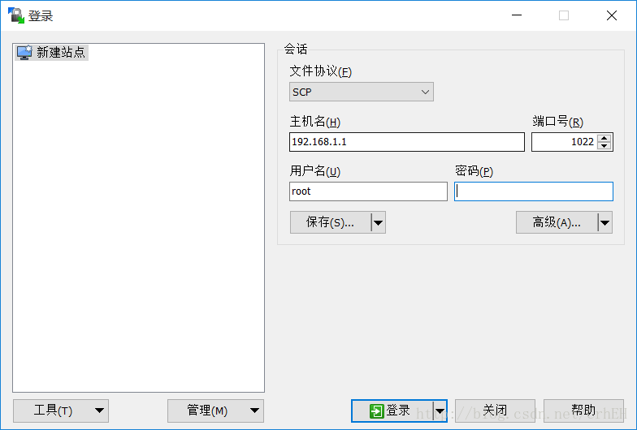


登陆成功后进入`/tmp目录`，将刚才下载的[breed-mt7628-hiwifi-hc5661a.bin](./breed/breed-mt7628-hiwifi-hc5661a.bin)上传到这个目录

<br /><br />

## 刷入Breed

使用[putty64](./software/putty64.exe)登入你的路由器后台，主机名、账号、密码、端口均与上述相同，登入成功后键入以下命令

`mtd -r write /tmp/breed-mt7628-hiwifi-hc5661a.bin u-boot` 

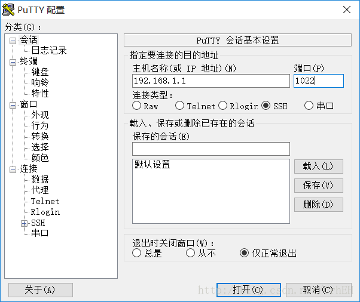

显示rebooting后等待路由重启完成，不死uboot就完成了刷入了。（注意，为了确定百分百刷入成功，建议此时什么都不要动，等待5分钟后再进行其他操作）

<br /><br />

# 步骤三:刷入OpenWrt 系统固件

## 下载对应的OpenWrt 系统固件

键入以下命令查看`路由器CPU的型号`，以确定我们要刷什么版本的固件

`cat /proc/cpuinfo`


点击这里[OpenWrt Downloads](http://downloads.openwrt.org/releases/18.06.2/targets/)下载对应型号的OpenWrt固件，以`极路由1S HC5661A`为例,点击下载[openwrt-18.06.2-ramips-mt76x8-hc5661a-squashfs-sysupgrade.bin](./openwrt/openwrt-18.06.2-ramips-mt76x8-hc5661a-squashfs-sysupgrade.bin)

如下图:

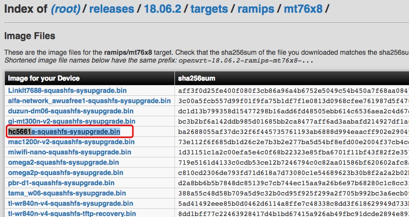

<br /><br />

## 开始刷入OpenWrt固件

本小节的步骤请严格按照先后顺序操作。

1. 用网线让路由器的LAN口与电脑的网口相连接； 
2. PC设置为自动获取IP(一般默认自动获取IP)；
3. 路由器断电(就是拔插头)； 
4. 首先按住reset不放！，确保没有松开reset键后，然后，插入路由器电源； 
5. 保持按住reset 3-4秒左右，路由器灯开始一闪一闪的时候，松开reset；
6. PC网卡获取到192.168.1.x的地址 （如未获取到手工设置），一般是192.168.1.1 ；
7. 浏览器访问 192.168.1.1，接着你就会看到一个uboot控制台的界面。


为了保险起见，首先进行固件备份，以备不时之需。严重强烈建议极路由用户刷Breed后，第一次进入后台就备份一次，这样以后想要重新刷回官方系统时原有功能不会受到影响，仍然能够访问云平台。

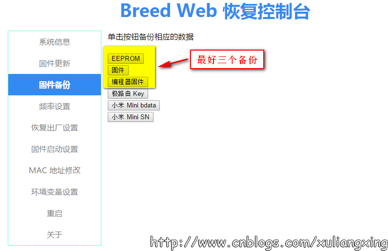


现在正是开始刷入OpenWrt固件，依次点击固件更新→勾选固件→点击选择文件，选择我们刚刚下载的[openwrt-18.06.2-ramips-mt76x8-hc5661a-squashfs-sysupgrade.bin](./openwrt/openwrt-18.06.2-ramips-mt76x8-hc5661a-squashfs-sysupgrade.bin)，然后耐心等待固件刷入完成。

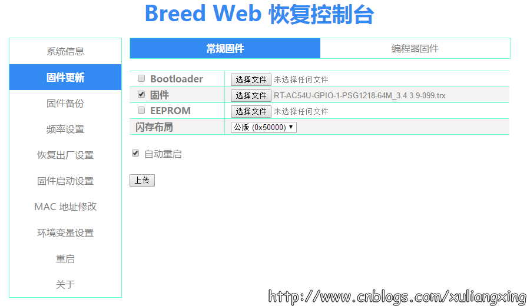


安装完成后会自动重启，这时可以不断刷新浏览器，直到管理界面显示出来，如果没有显示，建议稍后使用192.168.1.1访问管理页面。

账号:root

密码:默认为admin

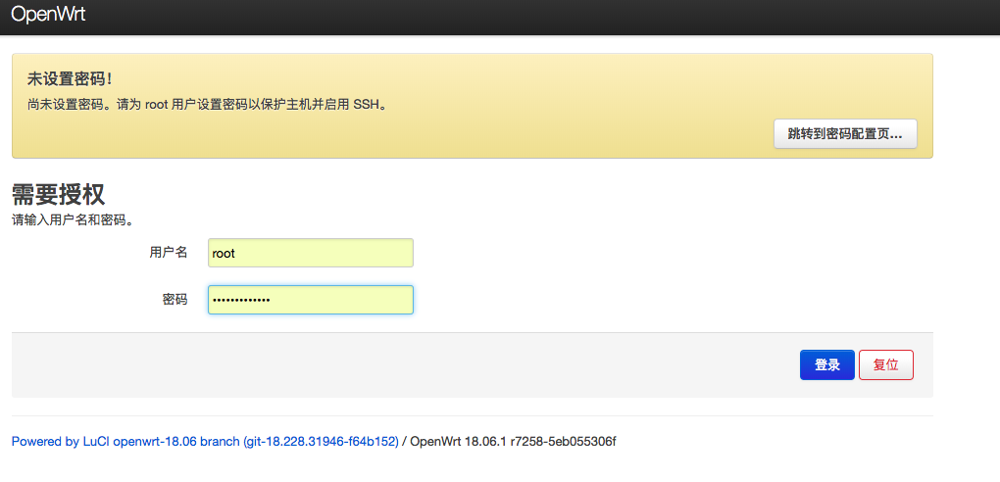


<br /><br />

# 步骤四:安装Dr.com插件

这里以`广工(广东工业大学)校园网为例`，其他学校请自行获得相应的Dr.com插件，如果您愿意折腾的话，可以[点击这里](https://github.com/drcoms/drcom-generic)自行编译合适自己的学校的Dr.com插件(需要较强的编程基础，建议还是找现成的)

以下是`广工(广东工业大学)校园网`各个路由器相应版本Dr.com插件下载

| 路由器版本                           | 下载链接                                                     |
| ------------------------------------ | ------------------------------------------------------------ |
| GDUT-极路由HC5661、HC5761和HC5861    | [下载链接](https://github.com/shengqiangzhang/Drcom-GDUT-HC5661A-OpenWrt/tree/master/drcom/GDUT-%E6%9E%81%E8%B7%AF%E7%94%B1-HC5661%E3%80%81HC5761%E5%92%8CHC5861) |
| GDUT-极路由HC5661A和HC5861B          | [下载链接](https://github.com/shengqiangzhang/Drcom-GDUT-HC5661A-OpenWrt/tree/master/drcom/GDUT-%E6%9E%81%E8%B7%AF%E7%94%B1-HC5661A%E5%92%8CHC5861B) |
| GDUT-极路由HC5962                    | [下载链接](https://github.com/shengqiangzhang/Drcom-GDUT-HC5661A-OpenWrt/tree/master/drcom/GDUT-%E6%9E%81%E8%B7%AF%E7%94%B1-HC5962) |
| GDUT-极路由HC6361                    | [下载链接](https://github.com/shengqiangzhang/Drcom-GDUT-HC5661A-OpenWrt/tree/master/drcom/GDUT-%E6%9E%81%E8%B7%AF%E7%94%B1-HC6361) |
| GDUT-斐讯K2T                         | [下载链接](https://github.com/shengqiangzhang/Drcom-GDUT-HC5661A-OpenWrt/tree/master/drcom/GDUT-%E6%96%90%E8%AE%AF-K2T) |
| GDUT-斐讯K2P                         | [下载链接](https://github.com/shengqiangzhang/Drcom-GDUT-HC5661A-OpenWrt/tree/master/drcom/GDUT-%E6%96%90%E8%AE%AF-K2P) |
| GDUT-斐讯K1-PSG1208、K2-PSG1218和K2G | [下载链接](https://github.com/shengqiangzhang/Drcom-GDUT-HC5661A-OpenWrt/tree/master/drcom/GDUT-%E6%96%90%E8%AE%AFK1-PSG1208%E3%80%81K2-PSG1218%E5%92%8CK2G) |

> `说明:`由于路由器版本太多，若您在上面没有找到对应的路由器型号，建议选择自己编译(难度很低)


将下载的`Dr.com插件`用`WinSCP`传到路由器`/tmp`文件夹下(WinSCP的使用方式上面已经阐述过)。

打开并登录putty，进行安装Dr.com，请键入以下命令：

```
cd /tmp
opkg install gdut-drcom_6.0-4_mipsel_24kc.ipk
```

至此，Dr.com插件安装完毕。

<br /><br />

对于没有上述对应型号路由器的`广工(广东工业大学)同学`，可进行以下步骤进行编译生成自己的Dr.com插件.

1.首先`路由器CPU的型号`，键入以下命令查看`cat /proc/cpuinfo`

2.然后进入[OpenWrt 18.06](https://archive.openwrt.org/releases/18.06.0/targets/)，根据自己路由器的`路由器型号`进入相应的网站,`以极路由HC5661A为例`,进入[ramips/mt76x8](https://archive.openwrt.org/releases/18.06.0/targets/ramips/mt76x8/)，找到[openwrt-sdk-18.06.0-ramips-mt76x8_gcc-7.3.0_musl.Linux-x86_64.tar.xz](https://archive.openwrt.org/releases/18.06.0/targets/ramips/mt76x8/openwrt-sdk-18.06.0-ramips-mt76x8_gcc-7.3.0_musl.Linux-x86_64.tar.xz)并下载

3.打开并登录putty，键入以下命令：

```c
#解压文件夹
tar xjf openwrt-sdk-18.06.0-ramips-mt76x8_gcc-7.3.0_musl.Linux-x86_64.tar.xz
cd ~/openwrt-sdk-18.06.0-ramips-mt76x8_gcc-7.3.0_musl.Linux-x86_64.tar.xz/

#进入package下载软件包
cd package && git clone https://github.com/GJXS1980/ODP.git

#编译
cd .. && make package/ODP/compile
```


4.最后编译完的软件包在`/bin/packages/xxxx/base/`目录下,到这里你也有一个适合自己路由器的drcom插件了,回到[步骤四](#步骤四:安装Dr.com插件)安装Dr.com客户端

<br /><br />

# 步骤五:配置上网

1.点击 Network（网络）-> Interfaces（接口），点击“WAN”对应的 Edit(编辑) 按钮。

- Protocol（通信协议）：改选为`PPPoE`，然后点击出现的 Switch Protocol（切换协议）按钮。
- PAP/CHAP username（PAP/CHAP 用户名）：学号
- PAP/CHAP password（PAP/CHAP 密码）：校园网密码

点击 Save & Apply（保存并应用）。这时，路由器本身和有线网已经可以上网了。


2.点击 Network -> Wireless（无线）。如果提示 Disabled（已禁用）就点击 Enable（启用）。可能只有一个 2.4G 的，也可能有一个 2.4G 的、一个 5G 的。点 2.4G 的 Edit(编辑) 按钮。

- ESSID：填 WiFi 的名字。


3.点击 Wireless Security（无线安全）

- Encryption（加密）：改选为`WPA2-PSK`
- Key（密码）：填 WiFi 密码

- 点击 Save & Apply（保存并应用）

这时，WiFi 就可以正常联网啦。


4.配置dr.com客户端，这里以`广工(广东工业大学)`为例，进行如下配置：

- 点击 Network（网络）-> Interfaces（接口），查看LAN的MAC地址并复制


修改Dr.com客户端的配置

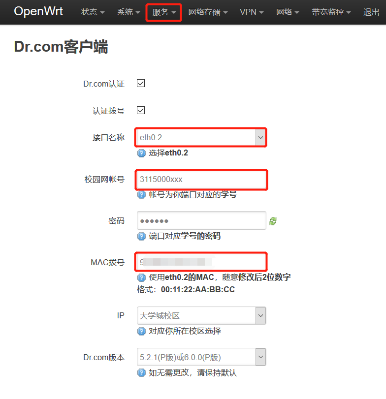


`配置完成后，重启路由器`，耐心等待若干分钟（15分钟内），查看是否拨号成功。

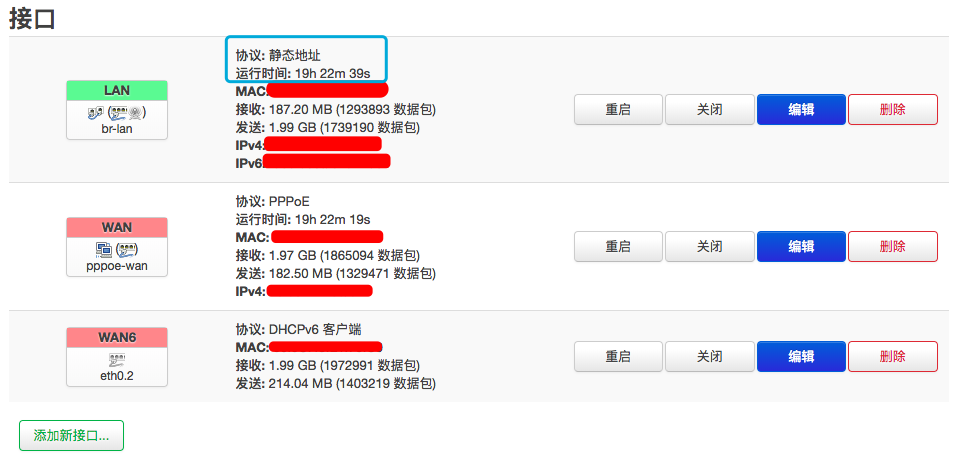

<br /><br />

# 步骤六:配置防检测

## 同步时间

NTP 就是用来同步两台电脑上的时钟的协议。接下来先启用 OpenWrt 自带的 NTP 服务器，然后将局域网内所有时钟校正的请求都发给路由器上的 NTP 服务器（也就是说，无视局域网内的电脑原本想要和哪台服务器同步时间，而强制将路由器上的时钟作为标准），这样局域网内所有的电脑上的时间都会变得一致。

点击 System（系统）->System（系统），只需要在管理页面中修改几个设置就可以了。

- 配置 NTP 服务。点击 System -> System。

  - 勾选 Enable NTP client（启用 NTP 客户端）和 Provide NTP server（作为 NTP 服务器提供服务）。

  - NTP server candidates（候选 NTP 服务器）四个框框分别填写

    `cn.pool.ntp.org`、`pool.ntp.org`、`time.apple.com`。

点击 Save & Apply 按钮。

- 配置防火墙转发。点击 Network -> Firewall（防火墙），然后点击 Custom Rules 标签，在大框框里另起一行，添加下面的代码：

  ```bash
  iptables -t nat -N ntp_force_local
  iptables -t nat -I PREROUTING -p udp --dport 123 -j ntp_force_local
  iptables -t nat -A ntp_force_local -d 0.0.0.0/8 -j RETURN
  iptables -t nat -A ntp_force_local -d 127.0.0.0/8 -j RETURN
  iptables -t nat -A ntp_force_local -d 192.168.0.0/16 -j RETURN
  iptables -t nat -A ntp_force_local -s 192.168.0.0/16 -j DNAT --to-destination 192.168.1.1
  ```

  第六行最后的`192.168.1.1`需要修改为你的路由器的管理页面地址。例如，你的管理页面地址是`192.168.10.1`，那么这一行代码需要修改为：

  ```bash
  iptables -t nat -A ntp_force_local -s 192.168.0.0/16 -j DNAT --to-destination 192.168.10.1
  ```

  然后点击 Restart Firewall（重启防火墙）。

  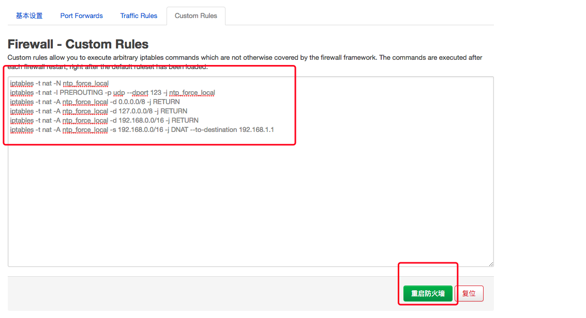

  <br /><br />

## 修改 HTTP 头的 UA标志

**UA 中包含了操作系统版本等信息，而 HTTP 协议没有对这些信息加密，因此别人可以从这里看到这个数据包发自 Windows 电脑还是安卓手机等(所以根据这个原理，能够实现检测到超过1台设备立即强制断网的效果)。接下来把所有 HTTP 头中的 UA 都改得一样(伪装成只有一台设备，所以就不会被强制断网了)。**


接下来，需要安装好 Privoxy 并正确配置，然后将所有 HTTP 流量转发给 Privoxy 代理，并在 Privoxy 中替换 UA。

- 安装 Privoxy。进入路由器管理页面，点击 System(系统) -> Software（软件包）。
  - 点击 Update lists（刷新列表）按钮，等待几分钟。如果提示好几条“Signature check passed”那么这一步执行成功；如果卡死了，几分钟后再进入这个页面，看到了很长很长的软件列表，那也是成功了。
  - 在 Filter（过滤器）中填写`luci-app-privoxy`，点击 Find package（查找软件包）按钮。点击下方“luci-app-privoxy”对应的 Install（安装）按钮。如果提示好几条“Configuring xxxx”，那么就是执行成功了；如果卡死后再进入管理页面，看到有一个 Services（服务）菜单，菜单里有 Privoxy WEB proxy（Privoxy 网络代理），那也是成功了。

  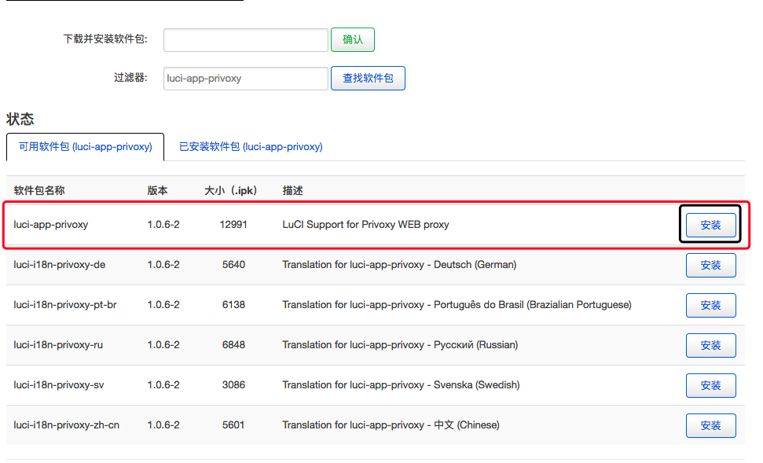

<br /><br />

- 配置 Privoxy 设置。点击 Services -> Privoxy WEB proxy。
  - Files and Directories（文件和目录）：Action Files 删除到只剩一个框，填入`match-all.action`。Filter files 和 Trust files 均留空。
  - Access Control（访问控制）：Listen addresses 填写`0.0.0.0:8118`，Permit access 填写`192.168.0.0/16`。Enable action file editor 勾选。
  - Miscellaneous（杂项）：Accept intercepted requests 勾选。
  - Logging（日志）：全部取消勾选。

点击 Save & Apply。

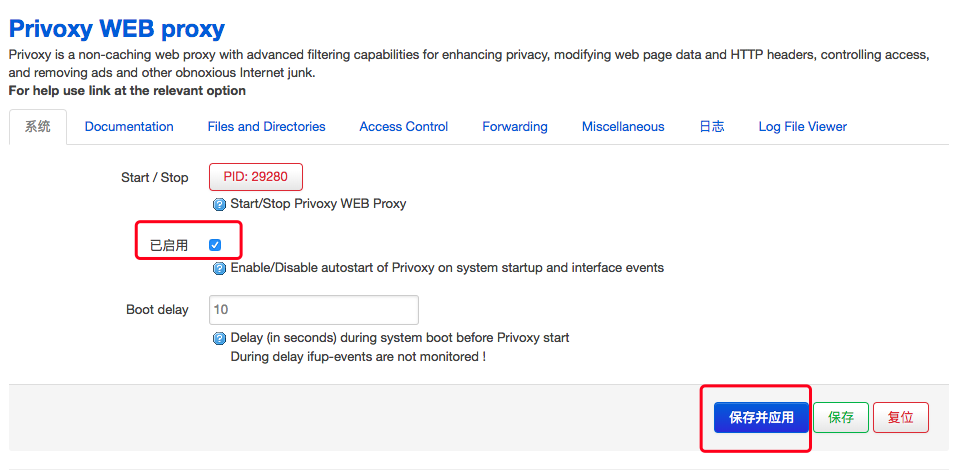

<br /><br />

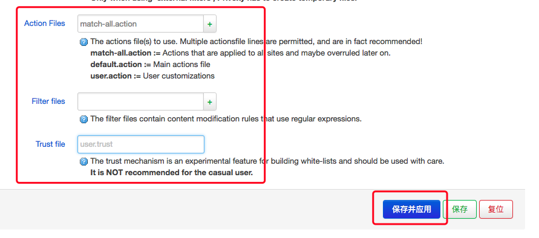

<br /><br />

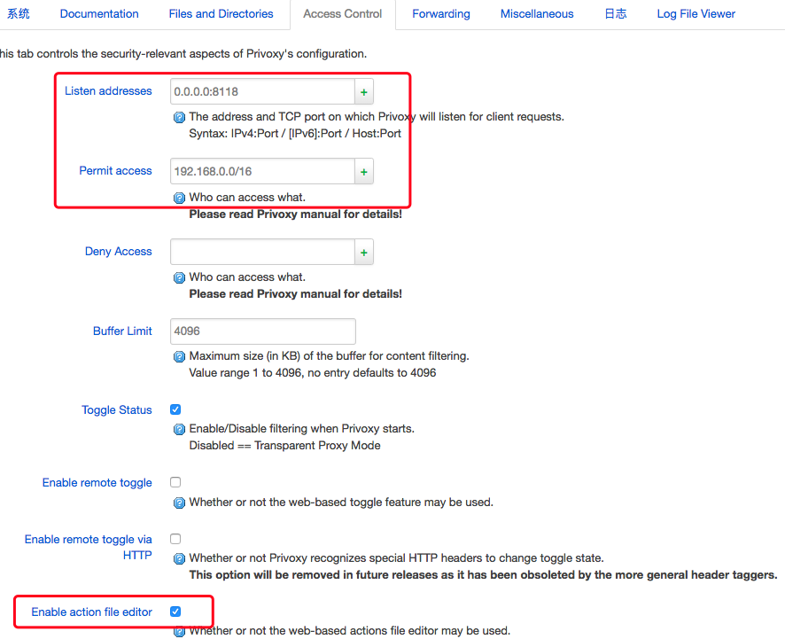

<br /><br />

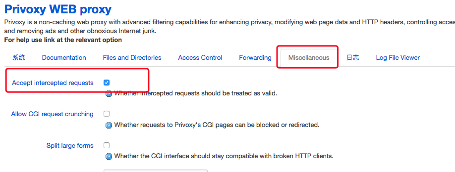

<br /><br />

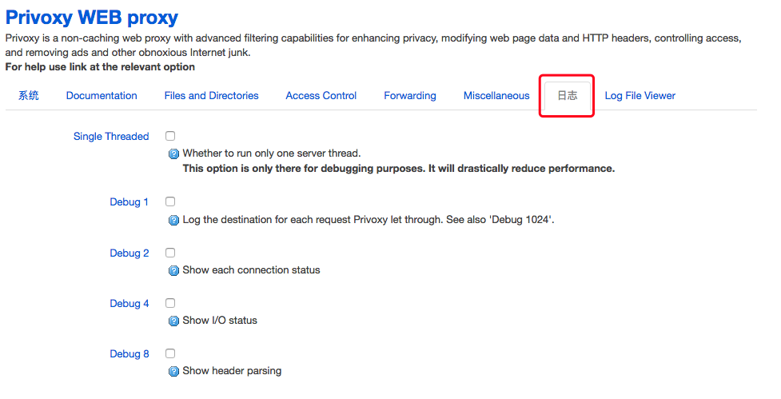

<br /><br />

- 配置防火墙转发。点击 Network -> Firewall（防火墙），然后点击 Custom Rules 标签，在大框框里另起一行(**注意，之前已经添加了6行代码，不要把刚刚添加的几行代码给删除了**)，添加下面的代码：

  ```
  iptables -t nat -N http_ua_drop
  iptables -t nat -I PREROUTING -p tcp --dport 80 -j http_ua_drop
  iptables -t nat -A http_ua_drop -m mark --mark 1/1 -j RETURN
  iptables -t nat -A http_ua_drop -d 0.0.0.0/8 -j RETURN
  iptables -t nat -A http_ua_drop -d 127.0.0.0/8 -j RETURN
  iptables -t nat -A http_ua_drop -d 192.168.0.0/16 -j RETURN
  iptables -t nat -A http_ua_drop -p tcp -j REDIRECT --to-port 8118
  ```

点击 Restart Firewall（重启防火墙）按钮。

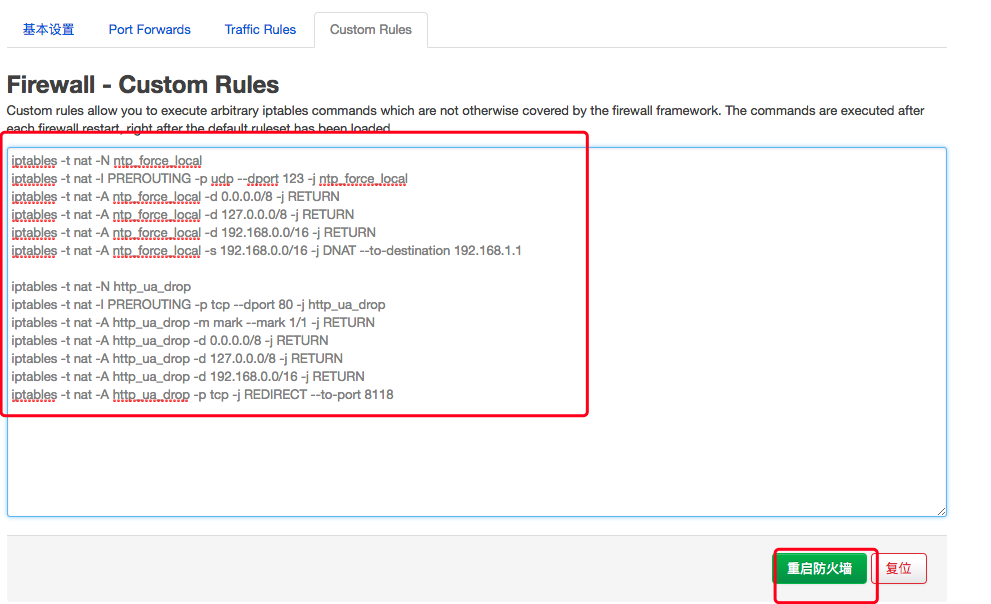

<br />

<br />

- 使用 Privoxy 替换 UA。打开`http://config.privoxy.org/edit-actions-list?f=0`，如果打不开，请重启路由器多测试几遍。点击 Edit 按钮。在Action 那一列中，hide-user-agent 改选为 Enable（绿色），在右侧 User Agent string to send 框中填写以下内容：

  `(Windows NT 6.3; WOW64) AppleWebKit/537.36 (KHTML, like Gecko) Chrome/69.0.3497.81 Safari/537.36`

其它全部选择为 No Change （紫色）。最后点击 Submit 按钮，再次重启路由器

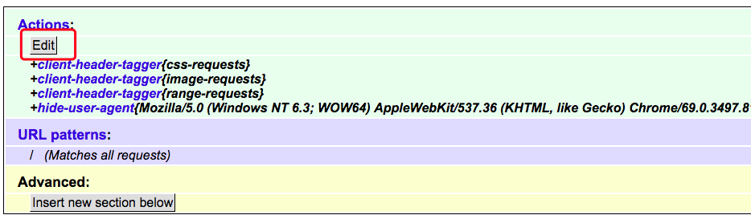

<br /><br />

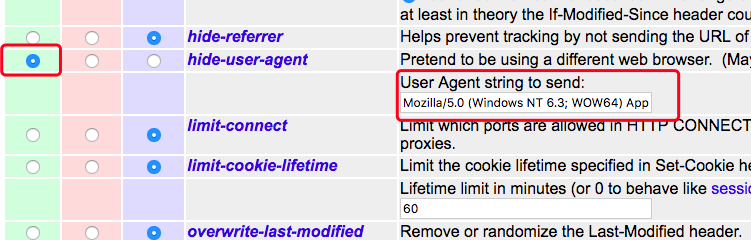


- 验证防检测效果。

  手机连接到该路由器的WIFI，使用手机(注意关闭**<u>为屁嗯</u>**后再测试)在浏览器打开`http://www.atool.org/useragent.php`，查看结果是否为Windows NT 6.3，而不是android或者iphone。

  <br />

  注意关闭**<u>为屁嗯</u>**后再测试！注意关闭**<u>为屁嗯</u>**后再测试！注意关闭**<u>为屁嗯</u>**后再测试！

  

  <br />

  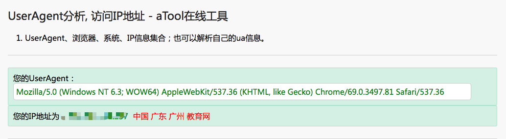

  <br />

  <br />

  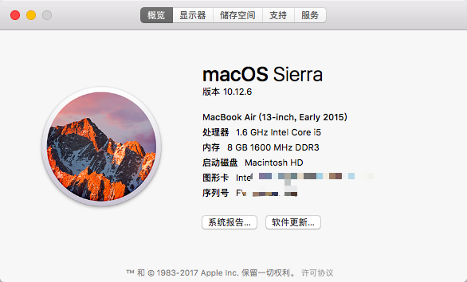

  <br /><br />

## 设置定时重启

由于使用了Privoxy代理，会使得所有的http流量均被转发到Privoxy，时间一旧，网络会变成异常慢。为了保证良好的网络，可以每天凌晨让路由器自动重启一遍以恢复路由器系统响应速度。

打开以下页面，键入以下代码(具体时间可自行更改)：

```
40 2 * * * sleep 5 && touch /etc/banner && reboot   //每天凌晨2点40分路由器自动重启
40 4 * * * sleep 5 && touch /etc/banner && reboot   //每天凌晨4点40分路由器自动重启
40 6 * * * sleep 5 && touch /etc/banner && reboot   //每天凌晨6点40分路由器自动重启
```


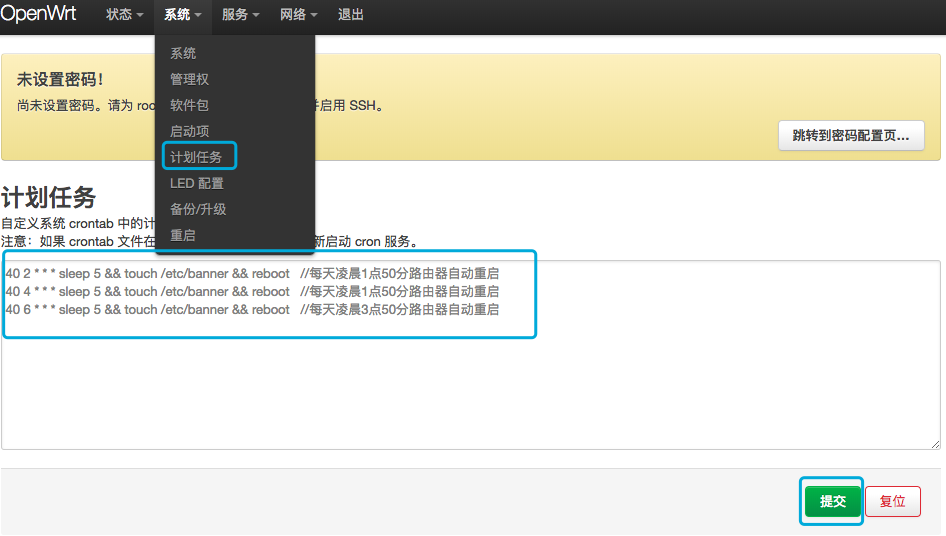


提交后，然后打开以下页面，重启`cron`服务

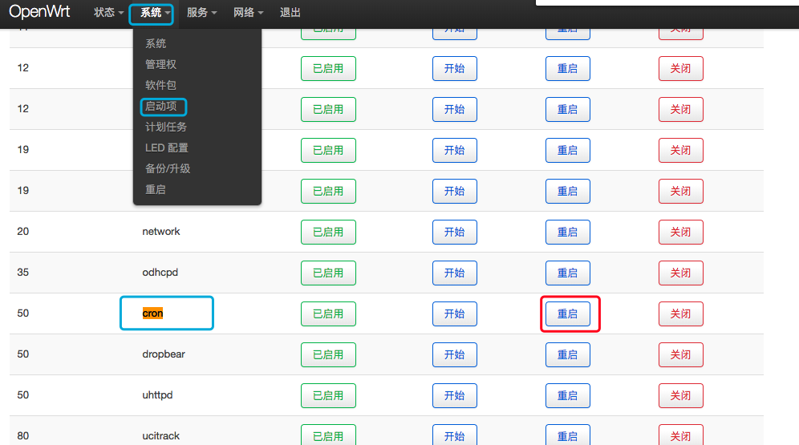


至此，所有步骤均已配置完毕，可以安心上网了。

<br /><br />

# 补充

`完整版`请点击这里打开[GitHub项目地址](https://github.com/shengqiangzhang/Drcom-GDUT-HC5661A-OpenWrt)

欢迎您[star本项目](https://github.com/shengqiangzhang/Drcom-GDUT-HC5661A-OpenWrt)


如您有疑问，请发送邮件至sqzhang77@gmail.com